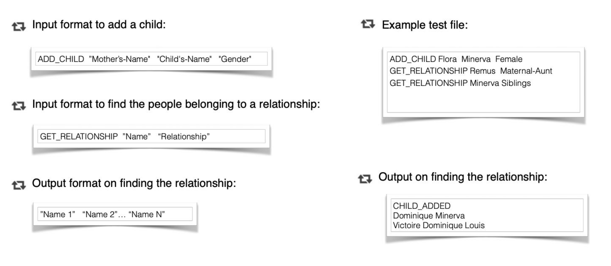
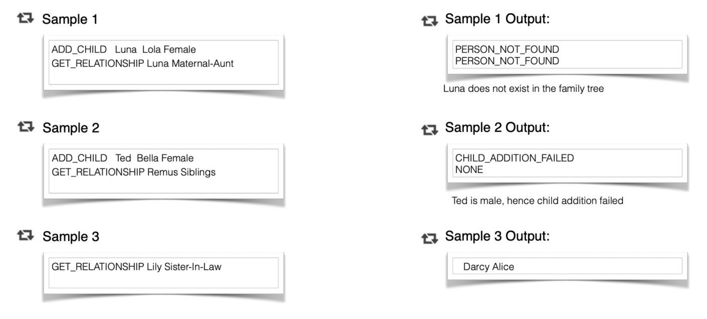

# Family Tree Generator with Graph Analysis using PySpark
This application generates a family tree based on a structured csv data file. Children are added to the graph
via the Mother and data file's schema reflects this. After generating the base graph from the data file, the user can
add more nodes to the graph as described below and query relationships. In addition to that the application can be used with PySpark to do 
graph analysis as shown below.

## Dependencies
* Python 3.7 or above. This app is developed using Python 3.9
* All other depedencies are listed in ./requirements.txt

## How to run the family tree generator application

1. Create a python virtual environment: `python3 -m venv name_of_the_venv`
2. Activate the virtual environment: `source path_to_venv/bin/activate`
3. Change into the unzipped source directory
4. Install dependencies: `pip install -r requirements.txt`
5. Run tests as `python -m unittest familytree.test_familygraph`
6. Run `python tree_manager.py family_dataset.txt`
7. This will open up an interactive command prompt for you to run the ADD_CHILD and GET_RELATIONSHIP commands as mentioned
in the below instructions inside the command prompt.

## Assumptions
* Names can't have spaces. If a name has 2 parts, connect them with a dash. e.g Queen-Margret
* All names must be unique
* Data file should contain the entries in the existing order starting from Queen Margret. Family hierachy must be maintained.
* Eventhough same sex couples can be added, they each need to identify themselves as either husband or wife.
* Parents of King and Queen's non-blood relatives(Childern's spouses for example) aren't available

## Sample Input/Output
Input is read from a text file and output will be printed to console. **The program
takes the location to the test data file as a parameter**.

More sample output scenarios.

**You need to stick to the Sample input output format as shown**.

## Relationships Handled

There are many relationships that could exist but the code only handles the following
relationships at the moment in addition to "Mother" and "Father".

## How to do graph analysis using PySpark
To do the analysis, a user can start a pyspark session on the command line as below.
1. Terminate the graph application you were running.
2. From within the same location(unzipped folder), run pyspark as 
`pyspark --packages graphframes:graphframes:0.8.2-spark3.2-s_2.12`
3. This will open up an interactive pyspark session. Make sure it successfully downloaded the `graphframes`
package.
4. Then you can do graph analysis as below:

`from familytree.familygraph import FamilyGraph`

`from graphframes import *`

`from pyspark.sql import *`

`from pyspark.sql.functions import *`

`fg = FamilyGraph()`

`fg.populate_graph('./family_dataset.txt')`

`fg.get_relationship('Bill', 'Siblings')`

`fg.add_child('Queen-Margret', 'Peter', 'M')`

`v = sqlContext.createDataFrame(list(zip(fg.fam_graph.nodes)), ['id'])`

`e = sqlContext.createDataFrame(list(fg.fam_graph.edges), ['src', 'dst'])`

`v.show()`

`fgf = GraphFrame(v, e)`

`fgf.inDegrees.show()`

`fgf.edges.groupBy("src").count().orderBy(desc("count")).show()`